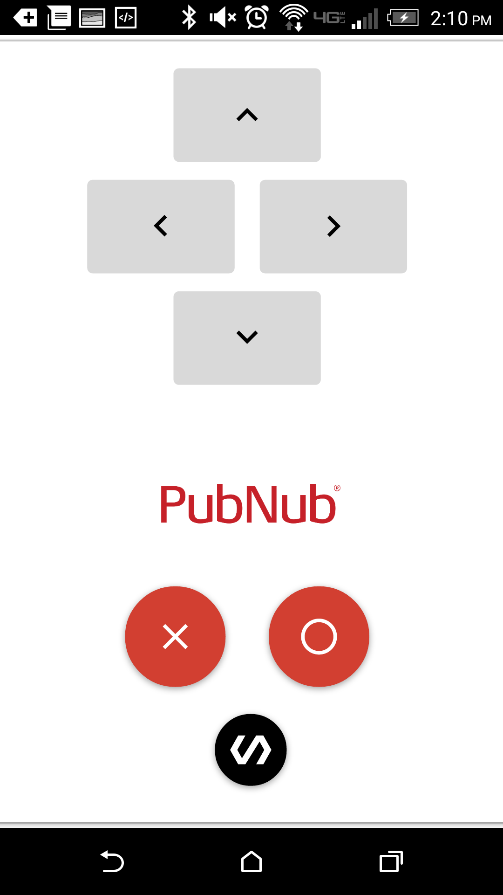
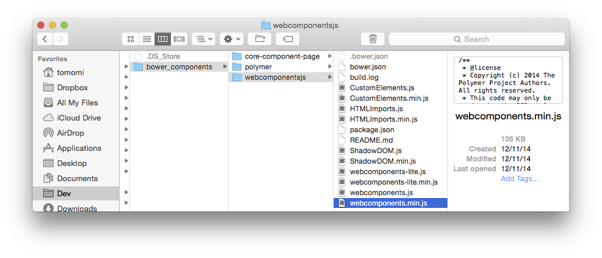

### Turn Your Smartphone into a Wiimote Using Polymer:

With all this technology around us, it's surprising that most devices do not interact with each other. Take your smartphone and your laptop for example, they probably sit less than a foot apart on your desk, but they rarely talk. I am going to show you how to use PubNub and Polymer to bridge that gap by turning your smartphone into a [Material Design][MaterialDesign] gamepad.

The [live demo of PubMote][PubMote] can be seen here. Navigate to the [controller][PMController] on your smartphone and to one of the [demos][PubMote] on your desktop. In this blog post I will show you how to create your PubMote and how to use it for HTML5 games. Your gamepad can have any design you want, with any features. Trackpad, buttons, accelerometer, anything goes. The PubMote I cover in this guide will have four arrow keys, a bar that tilts with the accelerometer, and three action buttons. If you need a reference at any time, use the [full code](https://github.com/GleasonK/PubMote).



#### Prerequisites 
- Basic knowledge of Polymer 
- Basic understanding of [Bower](https://www.polymer-project.org/0.5/docs/start/getting-the-code.html) package management tools to install and manage dependencies of Polymer component files is helpful, but I will walk you through it.

### Polymer and Material Design

[Polymer] provides an interesting way to go about web development. It is built on top of a set of new W3C platform called [Web Components](http://www.w3.org/wiki/WebComponents/). This standard allows you to use both pre-made and custom blocks of HTML to build a larger webapp. 

Before one of these building block elements can be used, you must first import it. A typical use will look as follows:

```
<!-- First Import: -->
<link rel="import" href="paper-fab.html"> 
... 
<!-- Then use: -->
<paper-fab icon="send"></paper-fab>
```

Polymer comes with many pre-made elements, all of which follow the [Material Design][MaterialDesign] standards that were created for Android 5.0 Lollipop. The material design elements that come with Polymer are called _Paper Elements_, and they are responsive to different screen sizes and devices.

### 1. Creating Your Material Design Gamepad

Let's begin designing and developing our gamepad. First, we need to install Polymer so we can use its Material Design UI components and functionality.

#### 1.1 Install Polymer
The first step to creating your gamepad is [Installing Polymer](https://www.polymer-project.org/0.5/docs/start/getting-the-code.html) in your project. The easiest to do this is using Bower. To see other possibilities, check the [Polymer documentation](https://www.polymer-project.org/0.5/docs/start/getting-the-code.html).

	$ cd <Project-Root>
	$ bower init
	$ bower install --save Polymer/polymer#^1.0.0

Running those commands should result in the following file structure:



To get started using Polymer elements, include `webcomponents.min.js` in the `<head>` tag of your `index.html`.

```
<!DOCTYPE html> 
<html> 
	<head> 
		<script src="bower_components/webcomponentsjs/webcomponents.min.js"></script> 
	</head> 
<body> 
...
```


#### 1.2 Import UI Components

The PubMote UI is created solely using [Polymer Core and Paper elements](https://www.polymer-project.org/0.5/docs/start/usingelements.html). Let's create our custom pub-mote element so you can see how custom elements are structured. Create the file `<project-root>/elements/pub-control.html`. This is where we will build our remote. However, before we use elements to make our PubMote, we must install them.

Elements Used:
1. paper-button, a responsive and elegant button UI
2. paper-fab, a Material Design action button
3. iron-icons, used for gamepad icons (core-icons in v0.5)
4. hardware-icons, also used for gamepad icons

    bower install polymerelements/iron-iconset#^1.0.0
	bower install polymerelements/iron-icons#^1.0.0
	bower install polymerelements/paper-fab#^1.0.0
	bower install polymerelements/paper-button#^1.0.0

This will install all necessary components, for our Polymer project. Now, before elements can be used they must be imported in the `<head>` tag of `pub-control.html`.

```
<link href="../bower_components/polymer/polymer.html" rel="import">
<link href="../bower_components/paper-button/paper-button.html" rel="import">
<link href="../bower_components/paper-fab/paper-fab.html" rel="import">
<link href="../bower_components/iron-icons/iron-icons.html" rel="import">
<link href="../bower_components/iron-icons/hardware-icons.html" rel="import">
```

Now you can use all those Polymer elements you just downloaded and imported.

#### 1.3 Basic Gamepad UI

First, we will make our `<dom-module>` tag to house all Polymer elements. Inside that, we use `<div>` which we will later style to have the look of a Material Design paper-shadow [Card](http://www.google.com/design/spec/components/cards.html). Inside that we create arrow keys using a `<paper-button>` and an `<iron-icon>`. Then an `` tag for your controller logo to add some style to the controller. Our action buttons are `<paper-fab>` with `<core-icon>` icons.


The general layout of a custom element in polymer has an `id`, `<style>`, `<template>`, and `<script>`. My element inherits properties of a `dom-module`, so it is structured as follows.

```
<dom-module id="pub-control">
	<style>
		...
	</style>
	<template>
		...
	</template>
</dom-module>

<script>
  	// element registration
	Polymer({
		is: "pub-control",
		properties: {
			...
		},
		ready: function(){
			...
		}
	});
</script>
```

You can bind data inside the `<template>` tags, which we will cover shortly. The `Polymer` function in the `<script>` tags will register your element, and declare its properties and functions. Once your element has been loaded, the `ready` function is called, so you can do your setup logic in there. I will leave the styling to you, if you would like to see mine, [look here](https://gist.github.com/GleasonK/cf3b70692c3628b32d31#file-pubmote_style-css). Let's begin with the `<template>`

```
<template>
	<div id="gamepad"  class="card">
		<div id="arrow-btns"> 
			<p id="channel" hidden="{{!isConfigured}}">{{channel}}</p>
	    		<paper-button data-key="UP"  on-down="handleButton">
				<iron-icon data-key="UP" icon="hardware:keyboard-arrow-up"></iron-icon>
			</paper-button> <br>
			<paper-button  data-key="LEFT" on-down="handleButton">
				<iron-icon data-key="LEFT" icon="hardware:keyboard-arrow-left"></iron-icon>
			</paper-button>
			<paper-button  data-key="RIGHT" on-down="handleButton">
				<iron-icon data-key="RIGHT" icon="hardware:keyboard-arrow-right"></iron-icon>
			</paper-button> <br/>
			<paper-button data-key="DOWN" on-down="handleButton">
				<iron-icon data-key="DOWN" icon="hardware:keyboard-arrow-down"></iron-icon>
			</paper-button> <br>
			</canvas>
		</div>
		<div id="action-btns">
			<paper-fab icon="icons:close" data-key="X" on-down="handleButton"></paper-fab>
			<paper-fab icon="icons:radio-button-unchecked" data-key="O" on-tap="handleButton"></paper-fab>
			<br> 
			<paper-fab mini icon="polymer" style="background:black" on-tap="changeChannel"></paper-fab>
		</div>
	</div>
</template>
```

The `<p hidden="{{!isConfigured}}>` tag will only be displayed if the property `isConfigured` is true, and then it will display the channel name, which is the value of `{{channel}}`. This is called _data binding_, the values correspond to the Polymer element's properties with those respective names. We will change `isConfigured` when a user enters the name of a channel. 

Polymer uses `on-*` syntax for click events. For the gamepad I used `on-down` to trigger a press event, as a controller would. Then, for the channel button I used `on-tap` which waits for the button to be released. The `on-tap=exp` syntax is an event handler (on-tap), and an expression (exp). If you were familiar with Polymer v0.5, they have done away with `on-tap={{exp}}`, since you will only be binding functions with `on-*`. The curly brace binding is only still used for element properties, and when filing in standard HTML attributes, but not for Polymer functions.

The last potentially unfamiliar bit in this HTML is `data-key="<KEY>"`. HTML5 allows you to attach custom data to any tag. We will access this data in `handleButton` to differentiate which button was clicked, since all buttons call the same function.

Now we must create those properties and functions that our element uses.

```
<script>
  	// element registration
	Polymer({
		is: "pub-control",
		properties: {
			channel: {
				type : String,
				value: "demo"
			},
			isConfigured: {
				type : Boolean,
				value: false
			}
		},
		// add properties and methods on the element's prototype
		handleButton: function(e){
			...
		},
		changeChannel: function(e){
			...
		},
		ready: function(){			
			...
		}
	});
</script>
```

This is how `properties` are declared. I declare the property name, type, and default value. See more options of [_Declared Properties_ here](https://www.polymer-project.org/1.0/docs/devguide/properties.html).

Elements also have optional attributes that you can find in the [documentation](https://www.polymer-project.org/0.5/docs/elements/paper-fab.html). I used `<paper-fab mini>` to create the smaller bottom button. Basic CSS can also be used on an element's tag. For example, if you want to change the color of your `<paper-fab>` buttons you could do the following:

```
paper-fab {
	background:red;
}

...
<paper-fab mini icon="polymer" style="background:black" on-tap="changeChannel"></paper-fab>
```

#### 1.4 Using your custom element

Back to your `index.html` we go! Just like any Polymer element, import and use it.

```
<!DOCTYPE html>
<html>
<head>
	...
	<script src="bower_components/webcomponentsjs/webcomponents.min.js"></script>
	<link href="element/pub-control.html" rel="import">
</head>
<body fullbreed unresolved>	
	<pub-control></pub-control>
</body>
</html>
```

It's that easy. The `fullbreed` attribute causes the body to fill the viewport, and the `unresolved` attribute will allow all Polymer elements to be loaded before being displayed, avoiding any flash of unstyled content issues (FUOC).

### 2. Implementing Our Gamepad

#### 2.1 Installing and Importing PubNub

PubNub has a Polymer element pre-made. The `<pubnub-element>` does not have any UI, but it can be used to publish messages from our gamepad. It requires your own API keys, so to continue, you need to [sign up for a PubNub account](http://www.pubnub.com/get-started/) to get your publish and subscribe keys. Your publish/subscribe keys are in the [Developer’s Admin Dashboard](https://admin.pubnub.com/).

Once you have completed that, `<pubnub-element>` can be downloaded using Bower.

	$ bower install --save pubnub-element
	
To import this element in your `pub-control.html`, using the following line:

```
<link rel="import" href="bower_components/pubnub-polymer/pubnub-element.html">
```

#### 2.2 Using the PubNub Element

You can initialize the PubNub client using the `<core-pubnub>` element with your keys. Inside the `<core-pubnub>` we will use a `<core-pubnub-publish>` element to send keypresses from our gamepad. 

_Note: this element should be the last tag in the `<template>` of your `<pub-control>` element._

```
<template>
...
	<core-pubnub 
		publish_key="your_pub_key" 
		subscribe_key="your_sub_key">
		<core-pubnub-publish id="pub" channel="{{channel}}" message="Hello"> </core-pubnub-publish>
	</core-pubnub>
</template>
```

`<core-pubnub-publish>` is used to send messages to all subscribers of a channel. Also, since we use `{{channel}}` means that our template will need the property `channel`, which it has. Then, to publish a message, we need to access the `<core-pubnub-publish>` as follows.

```
Polymer({
  ...
  ready: function(){
    this.$.pub.message = {"type":"<type>", "data":"<data>"};
    this.$.pub.publish();
  }
});
```

You can access the `<core-pubnub-publish id="pub">` anywhere inside the `Polymer({...})` function by referring to `this.$.pub`.

#### 2.3 Implement Your Gamepad

All of our gamepad will be implemented in our `<pub-control>` element. Looking back through the code you will notice that so far the attributes that the template needs are:
- channel
- isConfigured
- handleButton
- changeChannel

We can begin my implementing those as follows:

```
Polymer({
	is: "pub-control",
	properties: {
		...
	},
	// add properties and methods on the element's prototype
	handleButton: function(e){
		this.$.pub.message = {"type":"button", "data":e.currentTarget.dataset.key};
		this.$.pub.publish();
	},
	changeChannel: function(e){
		var channel = prompt("Enter a channel: ");
		if (channel=="" || channel==null) channel="demo";
		this.channel = channel;
		this.isConfigured = true;
		// Changing this will reveal our <p hidden={{!isConfigured}}>{{channel}}</p>
		//  and display the value of this.channel
	},
	ready: function(){			
		...		
	}
});
```

Take a deep breath. Currently, all of our gamepad buttons are functional. If I press the `<paper-button data-key="UP" on-tap="handleButton">` button, it will call the template's handleButton function. That function pulls the data-key field ("UP"), and then publishes the value to the current channel. When a button is clicked, an `on-down` click event `e` is fired. To access the `data-key` of the HTML element that was clicked we use `e.currentTarget.dataset.key`.  


Welcome to 1989, we now have a functional Gameboy! We can do better than that though. The final step for us to catch the 2006 Wii is tracking the smartphone's accelerometer values so we can add tilts and shakes to our games.

First, add the accelerometer fields to your controller.

```
Polymer({
  ...
  properties: {
  	aX: {
  		type : Number,
  		value: 0
  	},
  	aY: {
  		type : Number,
  		value: 0
  	},
  	aZ: {
  		type : Number,
  		value: 0
  	},
  	xPos: {
  		type : Number,
  		value: 0
  	},
  	yPox: {
  		type : Number,
  		value: 0
  	},
  	speed: {
  		type : Number,
  		value: 0
  	},
  	...
  }
  ...
});
```

Now, we will implement the ready function for our element. I'm sure most of us know the jQuery $(document).ready() function. Polymer's ready is similar. When any `<polymer-element>` is loaded and ready to be rendered, it will then call its own `ready` function. Since we want to wait for our controller to be loaded before attempting it to run any code, we will begin to implement `ready` as follows:

```
Polymer({
  ...
  ready: function(){			
  	// Tilt of canvas
  	var iOS = /(iPad|iPhone|iPod)/g.test( navigator.userAgent );
  	var lastUpdate = Date.now();
  	var SHAKE_THRESHOLD = 1250;
  	...
  }
});
```

From my tests so far, it seems iOS and Android implemented their accelerometer in opposite directions. Shocking, I know. A left tilt on android produces the value of a right tilt on iOS. To make these values uniform, we store the boolean `iOS` which tells whether the controller is an apple product. The variable `lastUpdate` will be used to set a time threshold, so we aren't publishing a value every millisecond, that would be unnecessary and probably slow our game down. You may have to play around with the value of `SHAKE_THRESHOLD` a little bit, depending on what you consider a shake. We will get there though.

Now for the fun part. To start, we only want our gamepad to register accelerometer tilts if the device viewing the page has an accelerometer.

```
ready: function(){			
  	...
  	if (window.DeviceMotionEvent == undefined) {
        // No accelerometer is present. Use buttons. 
        alert("no accelerometer");
    }
    else {
        // Hooray, we have an accelerometer! Attach a decivemotion listener.
        alert("accelerometer found");
        window.addEventListener("devicemotion", accelerometerUpdate, true);
    }
}
```

If an accelerometer is found, we attach a `devicemotion` listener to our `window`. The second parameter, `accelerometerUpdate` is a function that will be called whenever device motion is seen.

```
ready : function(){
	...
	var self = this;
	function accelerometerUpdate(e) {
	    var timeNow = Date.now();
	    var timeDiff = timeNow - lastUpdate;
	    
	    if (timeDiff > 100) {
		    lastUpdate = timeNow;
			var aX = event.accelerationIncludingGravity.x*1;
			var aY = event.accelerationIncludingGravity.y*1; 
			var aZ = event.accelerationIncludingGravity.z*1;
			
			// Fix for iOS
			aX = iOS ? -1*aX : aX;
			
			//The following two lines are just to calculate a
			// tilt. Not really needed. 
			self.xPos = Math.atan2(aY, aZ);
			self.yPos = Math.atan2(aX, aZ);
			
			var dX = Math.abs(aX - self.aX);
			var dY = Math.abs(aY - self.aY); 
			var dZ = Math.abs(aZ - self.aZ);
			console.log("dX:" + dX + " " + "aX:" + aX + " this.aX:" + self.aX);
			self.speed = Math.abs(aX + aY + aZ - self.aX - self.aY - self.aZ)/ timeDiff * 10000;

			if (dX > 0.45) { 
			    
				self.aX = Math.floor(aX*2)/2.0;
				self.$.pub.message = {'type':'aX', 'data':self.aX};
				self.$.pub.publish();
			}
			if (dY > 0.25) { 
				self.aY = Math.floor(aY*2)/2.0;
				//sendData(controller.channel,"aY",controller['aY']); 
			}
			if (dZ > 0.25) { 
				self.aZ = Math.floor(aZ*2)/2.0;
				//sendData(controller.channel,"aZ",controller['aZ']); 
			}
			
			if (self.speed > SHAKE_THRESHOLD) { 
				self.$.pub.message = {'type':'shake', 'data':self.speed};
				self.$.pub.publish();
			}
		}  	
	}		
}
```

There is a scoping issue with polymer and the use of Shadow DOM, but in an event listener, we do not have access to our element's properties. To get by this simply declare the variable `var self = this`. Read the code comments to see what is happening at each step, but for the most part this code just checks and publishes the aX tilt and device shakes. If you are holding the phone in portrait mode, `aX` is the tilt is left and right. A shake is based off how large the change in X,Y,Z coordinates was over the span of 100ms, a large change probably means a shake.


```
Found this "Android Accelerometer" image online, not sure about permissions. Probably just replace this section with the Vine.

Vine:
https://vine.co/v/ebKPzU31wME
```

Congratulations, you made your very own PubMote! Now we can go use it in some javascript games.

### 3. Using your PubMote

I am going to show you how to use your gamepad with a javascript game that uses the keyboard. To see an example of using the accelerometer, see [this code with comments](https://github.com/GleasonK/PubMote/blob/master/demos/wiinub.html), but we will be modifying Pac-Man (to create Pub-Man). 


I found [this javascript version of Pac-Man](https://github.com/GleasonK/PubMote/blob/master/demos/pacman/pacman.js) open source on github. It uses the N key to start the game and the arrow keys to control Pac-Man. To use the PubMote, I simply created a function in Pac-Man's `index.html` to simulate keypresses.

```
// Simulates clicking a key
function fireKey(el, key) {
    if (document.createEventObject) {
        var eventObj = document.createEventObject();
        eventObj.keyCode = key;
        el.fireEvent("onkeydown", eventObj);   
    } else if (document.createEvent) {
        var eventObj = document.createEvent("Events");
        eventObj.initEvent("keydown", true, true);
        eventObj.which = key;
        eventObj.keyCode = key;
        el.dispatchEvent(eventObj);
    }
}
```

Then, in your PubNub subscribe function, handle the controller button presses as keyboard events.

```
pubnub.subscribe({                                      
	channel : channelName,
	message : function(message){
		if (message.type == "button") {
			switch(message.data){
				case "UP":
					fireKey(el, 38);	// Up Arrow Key
					break;
				case "DOWN":
					fireKey(el, 40);	// Down Arrow Key
					break;
				case "LEFT":
					fireKey(el, 37);	// Left Arrow Key
					break;
				case "RIGHT":
					fireKey(el, 39);	// Right Arrow Key
					break;
				case "X":
					fireKey(el, 78);	// N Key
					break;
				case "O":
					fireKey(el, 78);	// N Key
					break;
				default:
					break;
			}
		}
	}
});
```

That's it. Now you can use your PubMote with JavaScript games!

[MaterialDesign]:http://www.google.com/design/spec/material-design/introduction.html

[PubMote]:http://kevingleason.me/PubMote/

[PMController]:http://kevingleason.me/PubMote/V05/controller.html

[Polymer]:https://www.polymer-project.org/0.5/

[PolymerIcons]:https://www.polymer-project.org/0.5/components/core-icons/demo.html

[AndroidPhoneGap]:http://www.pubnub.com/blog/how-to-convert-your-javascript-app-into-an-android-app-with-phonegap/

[iOSPhoneGap]:http://www.pubnub.com/blog/converting-your-javascript-app-to-an-ios-app-w-phonegap/